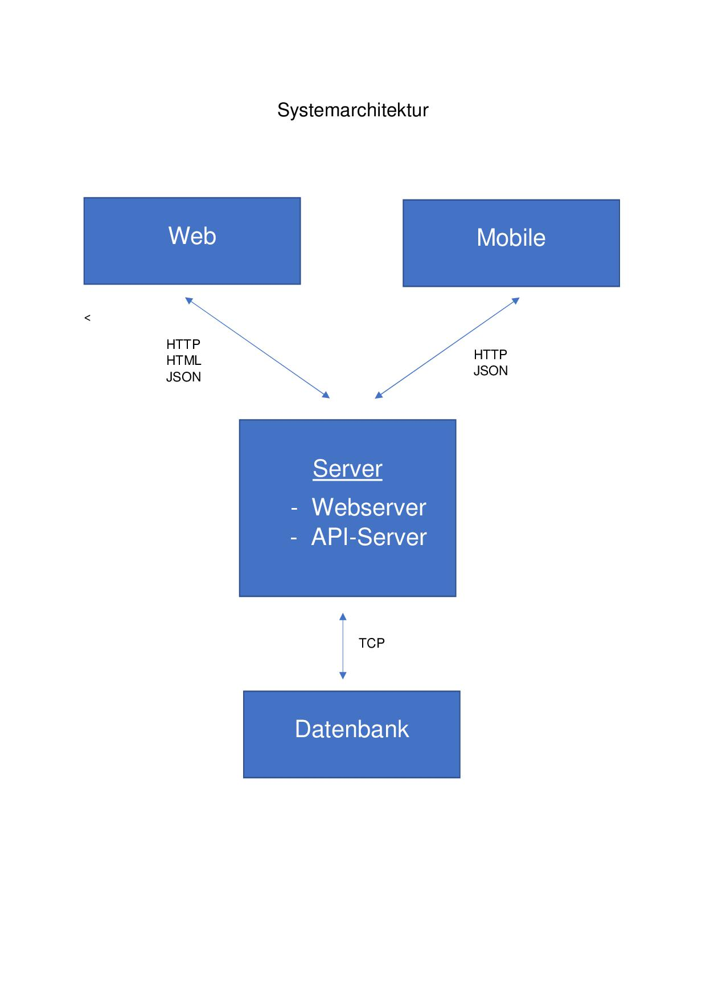
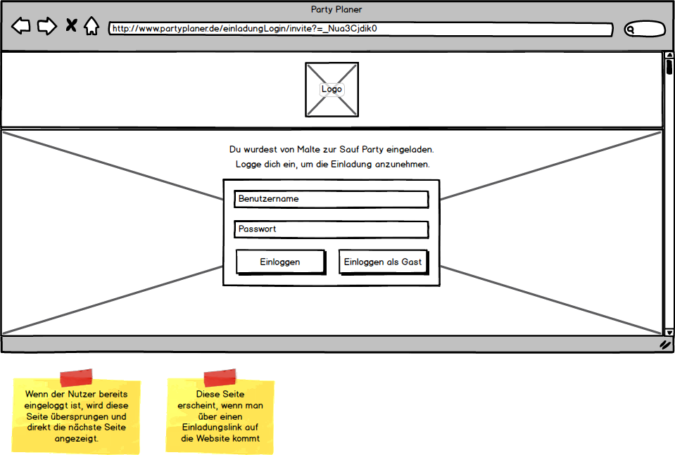

# Pflichtenheft

## Funktionale Anforderungen

### Grundfunktionen

#### Allgemein

- Einloggen
- Ausloggen

#### Impressum

- Impressum anzeigen

#### Hilfe

- Hilfe anzeigen

#### Kontaktformular

- Kontaktformular anzeigen
- Kontaktformular absenden

#### Benutzerverwaltung

- Benutzer erstellen
- Benutzerprofil verwalten/ändern
- Benutzerprofil löschen

#### Benutzerprofil

- Alle Veranstaltungen anzeigen
- Meine erstellten Veranstaltungen anzeigen
- Meine Einladungen anzeigen
- Meine Kontakte anzeigen
- Profil als Kontakt hinzufügen / entfreunden
- Profil suchen

#### Push-Nachrichten

- Push-Nachrichten automatisch versenden

### Veranstaltung

#### Allgemein

- Veranstaltung erstellen
- Veranstaltung verwalten
- Veranstaltung ändern
- Veranstaltung anzeigen --> Gast, Organisator
- Gästeliste

#### Berechtigungen

- Berechtigungen erteilen
- Berechtigungen entziehen
- Berechtigungen anzeigen

#### Einladungen

- Einladen via QR-Code
- Einladen via Weblink
- Einladen via Profil
- (Einladungen zurücknehmen?)
- Zu- und Absagen --> User, (Gast)
- Gästeliste anzeigen

#### Aufgaben

- Aufgaben anzeigen
- Aufgaben verwalten
- Aufgaben verteilen
- Aufgaben übernehmen

#### ToDo-Liste

- ToDo-Liste anzeigen
- ToDo-Liste verwalten

#### Kostenübersicht

- Kostenübersicht anzeigen
- Kostenübersicht bearbeiten

#### Galerie

- Startseite (einer bestimmten Galerie) anzeigen
- Fotos hochladen
- Fotos herunterladen
- Fotos anzeigen
- (Galerieübersicht (alle verfügbaren Galerien) anzeigen)
- (Fotos kommentieren?)

#### Kommunikation

- Kommentar erstellen 
- Kommentar bearbeiten
- Kommentar löschen
- (Privatchats)
- (Gruppenchats)

#### Abstimmungen

- Abstimmung erstellen
- Abstimmung bearbeiten
- Abstimmung anzeigen
- Abstimmen

#### Bewertung

- Bewertung anzeigen
- Bewertung abgeben
- Bewertung ändern

#### Einchecken

- Übersicht anzeigen
- Gast-QR-Code anzeigen
- QR-Code scannen
- Gast einchecken

#### (Social-Media)

- (Über Social-Media-Profil anmelden)
- (Bilder / Veranstaltung per Social-Media teilen)

## Nicht-Funktionale Anforderungen

### Server

### Datenbank

### App

- Android
- iOS
- (für Tablets optimiert)

### Webanwendung

- Desktopversion
- mobile Version

## Systemarchitekturdiagramm

## Detailbeschreibung

### Nicht-Funktionale Anforderungen

#### Webanwendung

Die Anwendung muss von den gängigen Browsern korrekt dargestellt werden.  Design und Bedienung der Website entsprechen den aktuellen Technologien und sind intuitiv. Die Webanwendung ist für mobile Geräte optimiert.

#### App

Eine native Lösung für Android und iOS muss angeboten werden. Design und Bedienung müssen dabei ebenfalls zeitgemäß und den Technologien angepasst sein.

Optional sind die Apps auch für Tablets optimiert.

#### Datenbank

Die Verwaltung der Daten muss ein entsprechendes Datenbankmanagmentsystem übernehmen. Es muss ausreichend dimensioniert sein, damit ausreichend Daten gespeichert werden können, sowie das Abrufen und Schreiben von Daten zügig erfolgt.

#### Server

Die Hauptanwendung muss auf einem Server laufen. Auch der Server muss ausreichend Ressourcen bereitstellen, damit ein Betrieb von mehreren Clients  gleichzeitig möglich wird.

### Funktionale Anforderungen

#### Grundfunktionen

##### Allgemein

###### Einloggen

Es ist möglich sich als registrierter Benutzer einzuloggen. Zusätzlich kann ein Einloggen als Gastuser möglich sein.

| Name      | Rolle | In meiner Rolle möchte ich | so dass                               | Akzeptanz        | Priorität |
| --------- | ----- | -------------------------- | ------------------------------------- | ---------------- | --------- |
| Einloggen | User  | mich einloggen             | ich auf meinen Account zugreifen kann | anmelden möglich | muss      |

###### Ausloggen

Es ist zu jeder Zeit möglich sich aus der Anwendung auszuloggen.

| Name      | Rolle | In meiner Rolle möchte ich | so dass                            | Akzeptanz        | Priorität |
| --------- | ----- | -------------------------- | ---------------------------------- | ---------------- | --------- |
| Ausloggen | User  | mich ausloggen             | ich nicht dauerhaft angemeldet bin | abmelden möglich | muss      |

##### Impressum

Das Impressum muss jeder Zeit erreichbar sein.

| Name               | Rolle | In meiner Rolle möchte ich        | so dass                                  | Akzeptanz           | Priorität |
| ------------------ | ----- | --------------------------------- | ---------------------------------------- | ------------------- | --------- |
| Impressum anzeigen | User  | mir das Impressum anzeigen lassen | ich weitere Informationen zum Betreiber des Dienstes erhalte | Impressum einsehbar | muss      |

##### Hilfe

Die Hilfe zur Anwendung muss jederzeit erreichbar sein.

| Name           | Rolle | In meiner Rolle möchte ich    | so dass                                  | Akzeptanz       | Prioritöt |
| -------------- | ----- | ----------------------------- | ---------------------------------------- | --------------- | --------- |
| Hilfe anzeigen | User  | mir die Hilfe anzeigen lassen | ich Probleme möglichst alleine lösen kann | Hilfe einsehbar | muss      |

##### Kontaktformular

Zusammenfassung der Kontaktdaten des Entwicklers. Hierzu gehören Firmenname, E-Mail, Adresse, Telefon und Angaben zur Erreichbarkeit.

| Name                     | Rolle | In meiner Rolle möchte ich              | so dass                                  | Akzeptanz                 | Priorität |
| ------------------------ | ----- | --------------------------------------- | ---------------------------------------- | ------------------------- | --------- |
| Kontakformular anzeigen  | User  | mir das Kontaktformular anzeigen lassen | ich mein Anliegen an den Betreiber formulieren kann | Kontaktformular einsehbar | muss      |
| Kontaktformular bedienen | User  | das Kontaktformular absenden            | der Betreiber mein Anliegen bearbeiten kann | Kontaktformular nutzbar   | muss      |

##### Benutzerverwaltung

Man muss sich registrieren können. Als registrierter Benutzer erhält man ein Benutzerprofil, über das man seine persönlichen Daten verwalten kann. Hierzu zählen Name,Adresse,Foto,vergangene Veranstaltungen, zukünftige Veranstaltungen... Auch muss man hier die Möglichkeit haben, den Benutzer zu löschen.

Für die Erstellung eines Profiles muss ein entsprechender Dialog existieren, in dem die oben genannten Daten abgefragt werden. 

Zusätzlich kann man auch die Anmeldung als Gast umsetzen. Als Gast hat man nur Zugriff auf eine Veranstaltung, muss dafür aber auch nur einen Namen angeben.

Wie man sich einloggen möchte, muss auf der Anmeldeseite abgefragt werden. Auf dieser Seite muss auch einen Dialog geben, falls ein registrierter Benutzer sein Passwort vergessen hat.

Es muss jeder Zeit möglich sein sich auszuloggen.

| Name               | Rolle | In meiner Rolle möchte ich              | so dass                                  | Akzeptanz            | Priorität |
| ------------------ | ----- | --------------------------------------- | ---------------------------------------- | -------------------- | --------- |
| Benutzer erstellen | User  | mir ein Benutzerprofil erstellen können | ich alle Funktionen der Anwendung nutzen kann | Registration möglich | muss      |
| Benutzer verwalten | User  | mein Benutzerprofil verwalten können    | ich Änderungen durchführen kann          | Benutzer verwaltbar  | muss      |
| Benutzer löschen   | User  | mein Benutzerprofil löschen können      | ich meine Profil und alle Daten entfernen kann | Benutzer löschbar    | muss      |

##### Benutzerprofil

Es muss eine Übersicht geben, wo der User all seine Veranstaltungen auf denen er war oder auch Kommende sehen kann. Auch muss es eine Übersicht aller aktuellen Einladungen und der Veranstaltungen, die man selber erstellt hat, geben.

Ebenfalls kann man sich all seine Kontakte anzeigen lassen. Um einen Kontakt hinzuzufügen, hat man auf fremden Profilen die Möglichkeit, diesen als Kontakt zu markieren oder demarkieren. Damit man fremde Kontakte finden kann, muss es eine Suchfunktion geben.

| Name                               | Rolle | In meiner Rolle möchte ich               | so dass                                  | Akzeptanz             | Priorität |
| ---------------------------------- | ----- | ---------------------------------------- | ---------------------------------------- | --------------------- | --------- |
| Alle Veranstaltungen anzeigen      | User  | mir all meine Veranstaltungen anzeigen lassen | ich einen Überblick über alle Veranstaltungen bekomme | Übersicht einsehbar   | muss      |
| Erstellte Veranstaltungen anzeigen | User  | mir all meine selber erstellten Veranstaltungen anzeigen lassen | ich mir einen Überblick über diese verschaffen kann | Übersicht einsehbar   | muss      |
| Einladungen anzeigen               | User  | mir meine Einladungen anzeigen lassen    | ich den Überblick habe, wo ich noch eingeladen bin | Einladungen einsehbar | muss      |
| Kontakte anzeigen                  | User  | mir meine Kontakte anzeigen lassen       | ich weiß, mit wem ich alles befreundet bin | Kontakte anzeigbar    | muss      |
| Kontakt hinzufügen                 | User  | einen anderen User als Kontakt hinzufügen | ich mit diesem auf der Platform befreundet bin | Kontakt hinzufügen    | muss      |
| Profil suchen                      | User  | ein anderen User suchen                  | mit diesem interagieren kann             | Profil suchbar        | muss      |

##### Push-Nachrichten

User erhalten per Push-Nachricht Erinnerungen zu ihren Veranstaltungen auf das Smartphone.

| Name                     | Rolle | In meiner Rolle möchte ich     | so dass                       | Akzeptanz                | Priorität |
| ------------------------ | ----- | ------------------------------ | ----------------------------- | ------------------------ | --------- |
| Push-Nachricht empfangen | User  | ich Push-Nachrichten empfangen | ich an Termine erinnert werde | Push-Nachricht erhaltbar | Muss      |

#### Veranstaltung

##### Allgemein

In der Veranstalung müssen die folgenden Informationen jederzeit jedem Gast/ Organisator zur Verfügung stehen. Auch müssen diese Informationen von den Organisatoren erstell- bzw. änderbar sein.

###### Name

Der Name der Veranstaltung. 

| Name           | Rolle       | In meiner Rolle möchte ich               | so dass                          | Akzeptanz       | Priorität |
| -------------- | ----------- | ---------------------------------------- | -------------------------------- | --------------- | --------- |
| Name anzeigen  | Gast        | mir den Namen der Veranstaltung anzeigen lassen | ich weiß, wie die Party heisst   | Name anzeigbar  | Muss      |
| Name verwalten | Organisator | den Namen der Änderung ändern können     | jeder weiß, wie die Party heisst | Name verwaltbar | Muss      |

###### Beschreibung

Ein freier Beschreibungstext zur Veranstaltung.

| Name                   | Rolle       | In meiner Rolle möchte ich               | so dass                                  | Akzeptanz                | Priorität |
| ---------------------- | ----------- | ---------------------------------------- | ---------------------------------------- | ------------------------ | --------- |
| Beschreibung anzeigen  | Gast        | Mir die Beschreibung zur Party anzeigen lassen | ich weitere Informationen erhalte        | Beschreibung lesbar      | Muss      |
| Beschreibung verändern | Organisator | die Beschreibung verändern können        | ich weitere Informationen mitteilen kann | Beschreibung veränderbar | Muss      |

###### Gastgeber / Ansprechpartner

Hier stehen der Gastgeber, bzw. die Organisatoren.

| Name              | Rolle | In meiner Rolle möchte ich | so dass                               | Akzeptanz           | Priorität |
| ----------------- | ----- | -------------------------- | ------------------------------------- | ------------------- | --------- |
| Gastgeber ansehen | Gast  | Mir die Gastgeber ansehen  | ich weiß, wer der Ansprechpartner ist | Gastgeber einsehbar | Muss      |

###### Ort

Ort der Veranstaltung. Hier muss nicht zwingend eine gültige Adresse eingegeben werden, damit auch benutzereigene Beschreibungen möglich sind. Wenn eine gültige Adresse eingegeben wurde, muss diese von Google Maps (Web, Android) oder Maps(iOS) verarbeitet werden können.

| Name                 | Rolle       | In meiner Rolle möchte ich               | so dass                                  | Akzeptanz             | Priorität |
| -------------------- | ----------- | ---------------------------------------- | ---------------------------------------- | --------------------- | --------- |
| Ort anzeigen         | Gast        | Mir den Ort anzeigen lassen              | ich weiß, wo die Party stattfindet       | Ort anzeigbar         | Muss      |
| Ort in Maps aufrufen | Gast        | Mir den Ort in einer Kartenanwendung anzeigen lassen | ich die Navi-Funktionen dieser Dienste nutzen kann | Ort in Apps aufrufbar | Muss      |
| Ort verwalten        | Organisator | den Ort verändern können                 | jeder weiß, wo die Party stattfindet     | Ort veränderbar       | Muss      |

###### Zeitpunkt

Datum und Uhrzeit der Veranstaltung. Es muss eine Verbindung zu den Systemkalendern (Android,iOS) bestehen, damit der Termin direkt übertragen werden kann. Auch müssen die Termine in einer Übersicht im Benutzerprofil angezeigt werden (Kalenderwidget).

| Name            | Rolle       | In meiner Rolle möchte ich               | so dass                                  | Akzeptanz        | Priorität |
| --------------- | ----------- | ---------------------------------------- | ---------------------------------------- | ---------------- | --------- |
| Zeit anzeigen   | Gast        | mir Datum und Zeit anzeigen lassen       | ich weiß, wann die Party stattfindet     | Zeit einsehbar   | Muss      |
| Zeit übertragen | Gast        | Mir Datum und Uhrzeit in Systemkalender übertragen | ich die party in meinem allgemeinen Kalender sehe | Zeit übertragbar | Muss      |
| Zeit ändern     | Organisator | Datum und Uhrzeit ändern können          | jeder weiß, wann die Party stattfindet   | Zeit änderbar    | Muss      |

###### Gästeliste

Es gibt eine Übersicht, in der die Gästeliste für alle einsehbar angezeigt wird.

| Name                | Rolle | In meiner Rolle möchte ich         | so dass                       | Akzeptanz            | Priorität |
| ------------------- | ----- | ---------------------------------- | ----------------------------- | -------------------- | --------- |
| Gästeliste anzeigen | Gast  | mir die Gästeliste angucken können | ich weiß, wer zur Party kommt | Gästeliste einsehbar | Muss      |

##### Berechtigungen

Der Organisator kann andere Gäste zu Organisatoren machen oder andere auf den Status eines normalen Gastes zurücksetzen.

Auch muss es eine Ansicht geben, in der alle Berechtigungen aufgelistet sind.

| Name                     | Rolle       | In meiner Rolle möchte ich               | so dass                                  | Akzeptanz                 | Priorität |
| ------------------------ | ----------- | ---------------------------------------- | ---------------------------------------- | ------------------------- | --------- |
| Berechtigungen erteilen  | Organisator | andere Gäste ebenfalls zu Organisatoren ernennen können | ich nicht alles alleine organisieren muss | Berechtigungen erteilbar  | Muss      |
| Berechtigungen entziehen | Organisator | andere Organisatoren wieder zu Gästen zurückstufen | ich die Berechtigungen verwalten kann    | Berechtigungen entziehbar | Muss      |
| Berechtigungen anzeigen  | Organisator | mir alle Berechtigungen zur Veranstaltung anzeigen lassen | ich diese anschließend verwalten kann    | Berechtigungen anzeigbar  | Muss      |

##### Einladungen

Einladungen können sowohl über QR-Code, als auch über Link versendet werden. Die Einladungen können in Zeit und Menge der Zusagen beschränkt werden. Ebenfalls muss man direkt Benutzerprofile einladen können.

Es gibt ein Menü, in dem die Gäste Zu- oder Absagen können. Auch eine Übersicht über den aktuellen Status der Gästeliste muss es geben.

Optional kann implementiert werden, dass Einladungen auch wieder zurückgenommen werden können.

| Name         | Rolle       | In meiner Rolle möchte ich               | so dass                               | Akzeptanz                 | Priorität |
| ------------ | ----------- | ---------------------------------------- | ------------------------------------- | ------------------------- | --------- |
| QR-Code      | Organisator | Einladungen via QR-Code verschicken können | ich Menschen einladen kann            | Code verschickbar         | Muss      |
| Weblink      | Organisator | Einladungen via Weblink verschicken      | ich menschen einladen kann            | Weblink verschickbar      | Muss      |
| Profil       | Organisator | Einladungen via Profil verschicken       | ich andere User einladen kann         | Einladung via Profil      | Muss      |
| Zurücknehmen | Organisator | Einladungen zurücknehmen                 | ich die Einladungen verwalten kann    | Einladung zurücknehmen    | Soll      |
| Übersicht    | Organisator | eine Übersicht über alle Eingeladene und deren Status habe | ich die Einladungen koordinieren kann | Übersicht der Einladungen | Muss      |

##### Aufgaben

Liste mit Aufgaben, die noch erledigt werden müssen. Mit dieser Funktion können zum Beispiel Mitbring-Buffets organisiert werden. Die Aufgaben können vom Organisator zugeteilt oder freiwillig von einem Gast übernommen werden.

| Name       | Rolle       | In meiner Rolle möchte ich | so dass                                 | Akzeptanz           | Priorität |
| ---------- | ----------- | -------------------------- | --------------------------------------- | ------------------- | --------- |
| anzeigen   | Gast        | alle Aufgaben einsehen     | ich eine übernehmen kann                | Aufgabe übernehmbar | Muss      |
| verwalten  | Organisator | die Aufgaben verwalten     | ich die Aufgaben anlegen/entfernen kann | Aufgabe verwaltbar  | Muss      |
| verteilen  | Organisator | anderen Aufgaben zuweisen  | ich die Aufgaben koordienieren kann     | Aufgabe verteilbar  | Muss      |
| übernehmen | Gast        | Aufgaben übernehmen können | dem Gastgeber helfen kann               | Aufgabe übernehmbar | Muss      |

##### ToDo-Liste

Die ToDo-Liste ist nur von dem Organisator einsehbar. Dieser kann die ToDo-Liste verwalten und Punkte hinzufügen oder löschen. Auch können bereits nortierte Punkte als erledigt markiert werden. Die ToDo-Liste muss von allen Organisatoren der Party verwaltbar sein. Es gibt pro Party maximal eine ToDo-Liste. Die Punkte stehen alle auf einer Ebene.

| Name      | Rolle       | In meiner Rolle möchte ich         | so dass                                  | Akzeptanz       | Priorität |
| --------- | ----------- | ---------------------------------- | ---------------------------------------- | --------------- | --------- |
| anzeigen  | Organisator | mir die ToDo-Liste anzeigen lassen | ich den Überblick über die Planung behalte | ToDo anzeigbar  | Muss      |
| verwalten | Organisator | die ToDo-Liste verwalten           | ich Punkte hinzufügen / entfernen kann   | ToDo verwaltbar | Muss      |

##### Kostenübersicht

Die Kostenübersicht ist nur von dem Organisator einsehbar. Dieser kann hier jede Ausgabe und Einnahme mitprotokollieren und erhält eine Gesamtsumme der Ein- oder Ausgaben.

| Name      | Rolle       | In meiner Rolle möchte ich         | so dass                             | Akzeptanz         | Priorität |
| --------- | ----------- | ---------------------------------- | ----------------------------------- | ----------------- | --------- |
| anzeigen  | Organisator | mir alle bisherigen Kosten ansehen | ich über alle Kosten informiert bin | Kosten anzeigbar  | Muss      |
| verwalten | Organisator | neue Kosten hinzufügen             | ich die Liste aktuell halten kann   | Kosten verwaltbar | Muss      |

##### Galerie

Pro Veranstaltung gibt es eine Galerie.  Diese besitzt einen Startbildschirm, in dem alle Bilder als Vorschau angezeigt werden. Die Bilder können dann ausgewählt werden und in groß angeguckt werden.

Auch werden hier Aktionen zum Up- oder Download von Bildern angeboten.

Optional kann auch eine Übersicht aller Galerien für einen Benutzer implementiert werden. Auch das Kommentieren von Fotos ist optional.

| Name                | Rolle | In meiner Rolle möchte ich         | so dass                                  | Akzeptanz            | Priorität |
| ------------------- | ----- | ---------------------------------- | ---------------------------------------- | -------------------- | --------- |
| Startseite anzeigen | Gast  | die Startseite einer Galerie sehen | ich einen ersten Eindruck der Bilder erhalte | Startseite anzeigbar | Muss      |
| Foto anzeigen       | Gast  | mir einzelne Fotos anzeigen lassen | ich mir diese genauer angucken kann      | Foto anzeigen        | Muss      |
| Fotos hochladen     | Gast  | Fotos hochladen können             | ich meine Fotos mit anderen teilen kann  | Fotos hochladen      | Muss      |
| Fotos downloaden    | Gast  | Fotos downloaden können            | ich bestimmte Fotos sichern kann         | Fotos downloaden     | Muss      |
| Fotos kommentieren  | Gast  | Fotos kommentieren können          | ich mit anderen zu dem Foto interagieren kann | Fotos kommentieren   | Soll      |

##### Kommunikation

In der Veranstaltung können Beiträge geschrieben, verändert oder kommentiert werden.

Optional können auch Chats unter registrierten Usern oder Gruppenchat implementiert werden.

| Name         | Rolle | In meiner Rolle möchte ich               | so dass                                  | Akzeptanz            | Priorität |
| ------------ | ----- | ---------------------------------------- | ---------------------------------------- | -------------------- | --------- |
| erstellen    | Gast  | Kommentare zur Veranstaltung erstellen können | ich mit anderen Gästen interagieren kann | Kommentar erstelbbar | Muss      |
| bearbeiten   | Gast  | meine Kommentare bearbeiten können       | ich Fehler korrigieren kann              | Kommentar bearbeiten | Muss      |
| löschen      | Gast  | meine Kommentare löschen können          | diese nicht mehr lesbar sind             | Kommentar löschen    | Muss      |
| Privatchats  | User  | mit einem anderen User schreiben können  | wir privat kommunizieren können          | Privatchats möglich  | Soll      |
| Gruppenchats | User  | mit einer Gruppe von anderen Usern schreiben können | wir privat kommunizieren können          | Gruppenchats möglich | Soll      |

##### Abstimmung

Es gibt eine Übersicht aller laufenden und vergangenen Abstimmungen zur Veranstaltung. Bei Auswahl einer Abstimmung, kann hier jeder Gast abstimmen.

Der Organisator kann Abstimmungen erstellen. Dazu kann er eine Fragestellung eingeben und die Laufzeit der Abstimmung auswählen. Nach Ablauf der Laufzeit wird automatisch eine Auswertung erstellt und angezeigt. Auch hat der Organisator hier die Möglichkeit die Abstimmung nachträglich zu verändern oder zu löschen.

| Name       | Rolle       | In meiner Rolle möchte ich               | so dass                                  | Akzeptanz              | Priorität |
| ---------- | ----------- | ---------------------------------------- | ---------------------------------------- | ---------------------- | --------- |
| erstellen  | Organisator | Abstimmungen in der Veranstaltung erstellen können | ich andere Meinungen abfragen kann       | Abstimmung erstellbar  | Muss      |
| bearbeiten | Organisator | Abstimmungen bearbeiten können           | ich das beste Ergebniss halte            | Abstimmung bearbeitbar | Muss      |
| anzeigen   | Gast        | mir Abstimmungen ansehen können          | ich sehe, wo meine Meinung benötigt wird | Abstimmung anzeigbar   | Muss      |
| abstimmen  | Gast        | abstimmen können                         | ich meine Meinung mitteilen kann         | Abstimmen möglich      | Muss      |

##### Bewertung

Nach der Veranstaltung können die Gäste eine Bewertung der Veranstaltung abgeben. Diese Bewertung kann nachträglich verändert werden.

| Name       | Rolle | In meiner Rolle möchte ich              | so dass                                  | Akzeptanz             | Priorität |
| ---------- | ----- | --------------------------------------- | ---------------------------------------- | --------------------- | --------- |
| anzeigen   | Gast  | das Ergebniss sehen                     | ich sehen kann, wie andere die Party fanden | Bewertung anzeigbar   | Soll      |
| abgeben    | Gast  | eine Bewertung zur Party abgeben können | ich meine Meinung mitteilen kann         | Bewertung abgebar     | Soll      |
| bearbeiten | Gast  | eine Bewertung ändern können            | ich Meinung ändern kann                  | Bewertung bearbeitbar | Soll      |

##### Einchecken

Das Einchecken kann ebenfalls von der Anwendung übernommen werden. Hierfür können Gäste sich auf dem Smartphone einen QR-Code anzeigen lassen. Dieser kann dann von dem Gastgeber per Smartphone eingelesen werden.

Auch eine Übersicht zu allen Gästen wird angezeigt.

| Name       | Rolle       | In meiner Rolle möchte ich           | so dass                    | Akzeptanz          | Priorität |
| ---------- | ----------- | ------------------------------------ | -------------------------- | ------------------ | --------- |
| Gast_QR    | Gast        | meinen Gast-QR-Code anzeigen lassen  | ich einchecken kann        | QR-Eincheckbar     | Soll      |
| Scannen    | Organisator | Gast-QR-Codes einscannen können      | ich Gäste einchecken kann  | Scannen möglich    | Soll      |
| Einchecken | Organisator | Gäste auch manuell einchecken können | die Gästeliste aktuell ist | Manuell einchecken | Soll      |

##### Social-Network

Dieser Menüpunkt kann optional implementiert werden.

Es gibt die Möglichkeit über ein Social-Network-Profil anzumelden. Auch können Bilder oder Veranstaltungen in Social-Media-Plattformen geteilt werden.

| Name     | Rolle | In meiner Rolle möchte ich               | so dass                                  | Akzeptanz        | Priorität |
| -------- | ----- | ---------------------------------------- | ---------------------------------------- | ---------------- | --------- |
| anmelden | User  | mich über andere Social-Media-Profile anmelden | ich möglichst wenige Profile habe        | Anmelden möglich | Soll      |
| teilen   | User  | Inhalte auf anderen Plattformen teilen   | möglichst viele Menschen an meinen Erlebnissen teilhaben | Inhalte teilbar  | Soll      |

## Mockups

### Website

#### Startseite

##### Index

##### Einloggen

##### Registrieren

##### Einladung Login

##### Einladung annehmen

#### Home

##### Hauptseite

##### Glocke offen

#### Profil

##### Hauptseite

##### Kontakt hinzufügen

#### Veranstaltung

##### Übersicht

##### Galerie

##### Bild ansehen

##### Kommentare

##### Aufgabenliste

##### Gästeliste

##### Abstimmungen

##### Abstimmung ansehen

##### Bewertung

#### Eigene Veranstaltung 

##### Gäste einladen

##### Kommentare

##### Aufgabenliste

##### Kostenübersicht

##### Gästeliste

##### Gästeliste einchecken

##### Abstimmungen

##### Abstimmung erstellen

##### Abstimmung ansehen

### App

#### Startseite

##### Index

##### Registrieren

##### Home

##### Menü

##### Impressum

#### Profil

##### Eigenes Profil

##### Fremdes Profil

##### Kontakte

##### Kontaktformular

#### Veranstaltung

##### Übersicht

##### Veranstaltung anschauen

##### Veranstaltung bearbeiten

##### Abstimmung ansehen

##### Abstimmung erstellen

## Glossar

### Absage

Der Gast plant auf keinen Fall zu der Veranstaltung zu kommen.

### Abstimmung

Kurze Meinungsabfrage zu einem bestimmten Thema. Enthält vorgegebene Möglichkeiten der Meinungsäußerung.

### Aufgabe

Tätigkeit, welche für eine Veranstaltung getan werden muss. Können von allen Gästen oder dem Organisator erledigt werden.

### Ausloggen

Abmelden von der Anwendung.

### Berechtigung

Definiert die möglichen Handlungen innerhalb einer Veranstaltung.

### Beschreibung

Freier Text ohne irgendwelche Vorgaben zu der Veranstaltung. Der Organisator kann sich hier einfach etwas ausdenken.

### Bewertung

Kurze Meinungsabgabe zu der Veranstaltung nach vorgegebenen Möglichkeiten. Die Möglichkeiten (Daumen hoch/runter) werden von dem Dienst vorgegeben.

### Browser

Programm zum Anzeigen von Internetseiten.

### Chat

Virtueller Raum, indem sich die Teilnehmer Nachrichten schicken können. Diese sind nicht von externen sichtbar.

### Einchecken

Der Gast ist auf der Party angekommen.

### Einladung

Offizielle Bitte um Teilnahme bei der Veranstaltung. Geht vom Organisator aus und enthält die wichtigstens Informationen zu der Veranstaltung.

### Einloggen

Anmeldung bei der Anwendung.

### Galerie

Übersicht über alle Fotos zu einer Veranstaltung.

### Gast

Besucher einer Party ohne organisatorischen Aufgaben.

Als Rolle: Gastrolle in einer Veranstaltung ohne weitergehende Funktionen.

### Gästeliste

Übersicht über alle Gäste, die zu der Party zugesagt haben.

Der Organisator kann ebenfalls noch die Absagen und die nicht beantworteten Einladungen einsehen.

### Gruppenchat

Chat zwischen mehreren Usern. Nur die Teilnehmer des Chats können an diesem teilnehmen oder ihn einsehen.

### Impressum

Angaben über Verlag, Autor, Betreiber der Anwendung.

### Kommentar

Öffentlich einsehbare Bemerkung zu einer Sache. Kommentare können von allen Personen mit Zugriff auf das Element gelesen und beantwortet werden.

### Kontakt

Ein als bekannt markierter User. Kontakte sind meistens Freunde, die die Anwendung ebenfalls benutzen.

### Kontaktformular

Vorgegebenes Formular, über das man direkt mit dem Betreiber des Dienstes kommunizieren kann.

### Kosten

Einzelne Ausgaben, die für die Veranstaltung getätigt worden sind.

### Kostenübersicht

Übersicht über alle Ein- und Ausnahmen einer Veranstaltung.

### Laufzeit

Zeit zwischen Start und einem festen Endpunkt einer Abstimmung.

### Organisator

Eine Person, die die Organisation der Party übernimmt. Diese koordiniert alle Aufgaben und legt auch die Eckdaten (z.B. Datum und Ort) fest.

Als Rolle: Übernimmt die Adminfunktionen in der Veranstaltung. Jeder Organisator ist auch ein User.

### Party

Eine Party ist eine einzelne, im privaten Rahmen stattfindende Festlichkeit. Eine Party ist eine einmalige Sache, d.h. es ist keine sich wiederholende Veranstaltung. Die Gäste sind dem Gastgeber alle (außer eventuell diverse Mitbringsel von anderen Gästen) bekannt und auch von ihm persönlich eingeladen worde.

### Privatchat

Zwei User schreiben sich untereinander. Dieser Chat ist von anderen Personen nicht einsehbar.

### Profil

Kontaktseite zu einer Person. Hier stehen die persönlichen Daten zu dem User, sowie Kontaktmöglichkeiten und Fotos von ihm.

### Registrieren

Erstmalige und einmalige Eingabe von Userdaten. Diese werden benötigt, damit das Profil eindeutig zugeordnet werden kann.

### Social Media

Soziale Plattformen zum Austauschen von Nachrichten. Hierzu zählen zum Beispiel Facebook und Google+.

### To-Do-Liste

Liste mit allen Tätigkeiten, die entweder bereits erledigt sind oder noch erledigt werden müssen.

### User

Als Rolle: Jeder Nutzer der Anwendung ist zu jederzeit ein User.

### Veranstaltung

Äquivalent verwendet zu "Party"

### Wann?

Zeit und Datum der Veranstaltung

### Was?

Titel der Veranstaltung.

### Webanwendung

Anwendungen, die über das Internet erreicht werden kann.

### Wer?

Organisator der Veranstaltung

### Zusage

Der Gast plant auf die Veranstaltung zu kommen.